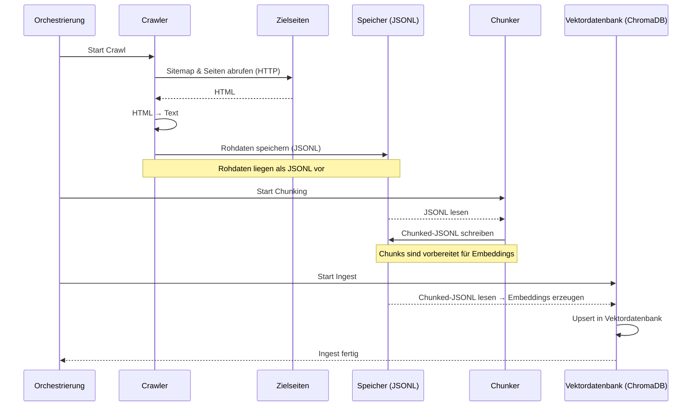
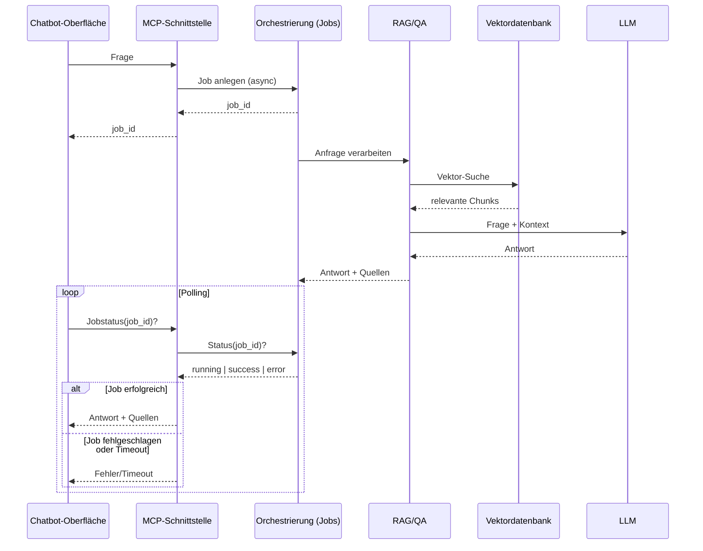

# MCP Server Docs

Dieses Projekt ist ein Prototyp, der im Rahmen einer Take-Home-Challenge entwickelt wurde.  
Ziel ist es, einen **MCP-Server** bereitzustellen, der technische Dokumentationen automatisch crawlt, in handliche Chunks zerlegt, in einer Vektordatenbank speichert und über **Retrieval-Augmented Generation (RAG)** für Fragen und Antworten verfügbar macht.  
So können MCP-Clients (z. B. GitHub Copilot Chat) oder ein einfacher Web-Chatbot auf die Inhalte zugreifen.

### Zweck des Chatbots (Scope-Hinweis)
Der Chatbot dient ausschließlich als **Test-Harness** für den MCP-Server. Er ist nicht Teil der Kernanforderungen.

## Architekturübersicht
### Pipeline zur Erstellung der Vektordatenbank

### Pipeline-Überblick

Die Orchestrierung steuert drei Schritte nacheinander:

1. **Crawl:** Zielseiten werden über eine Sitemap geladen, HTML wird zu Text verarbeitet und als **JSONL** gespeichert.
2. **Chunking:** Die Rohdaten (JSONL) werden eingelesen und in **Chunked-JSONL** zerlegt.
3. **Ingest:** Die Chunks werden eingebettet und in die **Vektordatenbank (ChromaDB)** geschrieben.

**Artefakte**
- **Rohdaten (JSONL)**: Aus dem Crawl erzeugte Textrepräsentationen.
- **Chunks (Chunked-JSONL)**: Vorverarbeitete Chunks für Embeddings.
- **Embeddings in Vektordatenbank (ChromaDB)**: Persistente Speicherung der Embeddings für spätere Anfragen.

### Nutzung des Chatbots


Die Interaktion zwischen Nutzer und Chatbot erfolgt in mehreren Schritten:

1. **Frage stellen**: Eine Anfrage wird über die **Chatbot-Oberfläche** eingegeben.

2. **Weiterleitung**: Die Frage wird von der Orchestrierung an den **RAG/QA-Service** weitergegeben.

3. **Retrieval**: Der Service sucht in der **Vektordatenbank (ChromaDB)** nach relevanten Dokument-Chunks.

4. **Antwortgenerierung**: Die gefundenen Chunks werden zusammen mit der ursprünglichen Frage an das **LLM** übergeben, das daraus eine Antwort formuliert.

5. **Polling und Rückgabe**: Die Chatbot-Oberfläche fragt regelmäßig den Jobstatus ab. Sobald die Orchestrierung die Antwort und Quellen bereithält, werden diese an die Oberfläche geliefert und angezeigt.

### Beteiligte Komponenten

- **Chatbot-Oberfläche**: Einstiegspunkt für Nutzerfragen und Anzeige der Antworten.

- **Orchestrierung**: Leitet Anfragen und Antworten zwischen den Komponenten weiter.

- **RAG/QA-Service**: Koordiniert Vektor-Suche und Antwortgenerierung.

- **Vektordatenbank (ChromaDB)**: Liefert relevante Dokument-Chunks.

- **LLM**: Generiert die endgültige Antwort aus Frage + Kontext.
### Beispielabfrage

How do I start a FastAPI server with uvicorn?

---
To start a FastAPI server with uvicorn, follow these steps:
1. Activate your development environment (not specified in the context).
2. Install Uvicorn by running `pip install "uvicorn[standard]"`.
3. If you haven't installed FastAPI yet, do so by running `pip install "fastapi[standard]"`. This will also install uvicorn[standard].
4. Replace 'main' with the name of your FastAPI application module and 'app' with the name of your FastAPI application instance in the following command:
```
uvicorn main:app --host 0.0.0.0 --port 80
```
This command starts the server on port 80, making it accessible from any network interface (0.0.0.0). Press CTRL+C to quit the server.

[[1] Run a Server Manually](https://fastapi.tiangolo.com/deployment/manually/)

### JSON-Antwort
````json
{
  "status": "success",
  "result": {
    "answer": "To start a FastAPI server with uvicorn, follow these steps:\n\n1. Activate your development environment.\n2. Install Uvicorn by running `pip install \"uvicorn[standard]\"`.\n3. Ensure you have a FastAPI application (e.g., `main.py` containing the FastAPI app instance).\n4. Run the server program using uvicorn, passing your application and the desired host and port:\n\n```\n$ uvicorn main:app --host 0.0.0.0 --port 80\n```\n\nThis command will start the FastAPI server on port 80 with the IP address 0.0.0.0, making it accessible from any network interface. Press CTRL+C to quit the server.",
    "sources": [
      {
        "url": "https://fastapi.tiangolo.com/deployment/manually/",
        "title": "Run a Server Manually",
        "heading": "",
        "distance": 0.44813549518585205,
        "overlap": 5
      }
    ]
  },
  "error": null
}
````
## Voraussetzungen

- [Ollama](https://ollama.com/) installiert  
- Git  
- [uv](https://github.com/astral-sh/uv) für Virtual Environments & Paketmanagement  

### Ollama vorbereiten
```bash
ollama pull mistral:7b-instruct
ollama run mistral:7b-instruct
```
(Oder ein anderes Modell – dann die entsprechenden ENV-Variablen wie `OLLAMA_MODEL` anpassen.)

## Installation
```bash
git clone https://github.com/tobiask42/mcp_server_docs.git
cd mcp_server_docs

# Virtuelle Umgebung erstellen
uv venv mcp-env-uv
source mcp-env-uv/bin/activate   # Linux/Mac
mcp-env-uv\Scripts\activate      # Windows
```
### Abhängigkeiten installieren
Für Windows
```bash
uv pip install -r requirements_cpu_win.txt
```
Für Linux
```bash
uv pip install -r requirements_cpu_linux.txt
```
Fallback
```bash
uv pip install scrapy loguru beautifulsoup4 pydantic pydantic-settings "pydantic[email]" chromadb mcp fastapi
```
### Variante mit GPU-Unterstützung für die erstellung der Embeddings
Passende Version von TensorRT installieren (Nvidia Account wird benötigt)<br>
Für Windows
```bash
uv pip install -r requirements_gpu_win.txt
```
Für Linux
```bash
uv pip install -r requirements_gpu_linux.txt
```
Fallback
```bash
uv pip install scrapy loguru beautifulsoup4 pydantic pydantic-settings "pydantic[email]" chromadb mcp fastapi "onnxruntime-gpu[cuda,cudnn]"
```
## Konfiguration
Erstelle eine `.env`-Datei im Projektverzeichnis oder setze die Variablen als Umgebungsvariablen.

### Pflichtwerte
```env
# Sitemap-URL für crawling
SCRAPE_URL=https://fastapi.tiangolo.com/sitemap.xml

# Kontaktadresse (wird im User-Agent verwendet)
EMAIL=email@example.com
```
### Optionale Werte (mit Defaults)
```env
# Verhindert ein ungewolltes Löschen einer existierenden Datenbank (Auf True setzen um Löschen zu erlauben) 
CHROMA_REMOVE_OLD=False

# Muss auf True gesetzt sein wenn ChromaDB die Datenbank mit GPU-Unterstützung erstellen soll
CHROMA_USE_GPU=False

CHROMA_BATCH_SIZE=1000
CHUNK_MAX_CHARS=1000
CHUNK_OVERLAP=100

CHROMA_N_RESULTS=3

# Werte für unbekannte Sections und Sections der Website, die nach Bedarf angepasst werden können.
SECTION_UNKNOWN=unknown
SECTION_CATEGORIES=["tutorial", "advanced", "reference", "alternatives", "deployment", "benchmarks"]


RAG_MAX_CONTEXT_CHARS=9000
RAG_MAX_CHUNKS_PER_URL=3

OLLAMA_MODEL=mistral:7b-instruct
OLLAMA_TEMPERATURE=0.1
OLLAMA_CONTEXT_WINDOW_TOKENS=4096
OLLAMA_MAX_TOKENS=768
OLLAMA_ENDPOINT="http://localhost:11434/api/chat"
OLLAMA_TIMEOUT_S=120

SYSTEM_PROMPT="You are a precise assistant for question answering over technical documentation.
        Rules:
        - Only use the information contained in the provided context.
        - If the context does not contain the answer, respond: I cannot verify that.
        - Do not invent or assume information.
        - Be concise and factual.
        - If the context contains multiple relevant sections, synthesize them into a coherent answer.
        - If the context contains contradictory information, indicate the uncertainty in your answer.
        - Do NOT include source URLs in your answer. The system will display sources separately."
# Zum Bau der query wenn kein Kontext vorhanden ist
NO_CONTEXT_PROMPT="Context:
            No relevant context found.
            Answer the question strictly based on the context above."
# Zum Bau der query wenn Kontext vorhanden ist
CONTEXT_PROMPT="Answer the question strictly based on the context above."

SPIDER_PRIORITY=spider
SPIDER_AUTOTHROTTLE_ENABLED=True
SPIDER_DOWNLOAD_DELAY=0.3
SPIDER_CONCURRENT_REQUESTS=8
SPIDER_HTTPCACHE_ENABLED=True

CRAWLER_LOG_LEVEL=INFO

# Optional für externe Dienste (Nutzung noch nicht implementiert)
API_KEY=
```
## Nutzung
Die Hauptskripte können in dieser Reihenfolge ausgeführt werden:
```bash
python scraper_main.py
python chunker_main.py
python db_creation_main.py
python rag_main.py
```
Alternativ dazu kann das Pipeline-Skript ausgeführt werden:
```bash
python pipeline_main.py
```

## MCP Server
Starte den MCP-Server
```bash
uv run mcp dev mcp_main.py
```
Im MCP Inspector kann eine Verbindung über "Connect" hergestellt werden.
Unter Tools → List Tools stehen die folgenden Tools bereit:

- `start_crawl`: Startet das Webscraping

- `start_chunk`: Führt das Chunking aus

- `start_ingest`: Befüllt die Vektordatenbank

- `start_pipeline`: Führt alle Schritte nacheinander aus

- `ask_job`: Beantwortet eine Frage, gibt job_id zurück

- `job_status`: Status des Jobs abfragen (queued, running, success, error)

- `job_log_tail`: Fortschritt/Logs eines Jobs ansehen

- `job_result`: Ergebnis eines Jobs abrufen (inkl. Antwort und Quellen)

## Beispielablauf mit MCP Inspector
1.  `start_pipeline` → gibt `{"job_id": "…"}` zurück

2.  `job_status <job_id>` → zeigt `running` / `success`

3.  `job_log_tail <job_id>` → zeigt den Fortschritt im Log

4.  `job_result <job_id>` → gibt die Antwort des RAG zurück
## Logs
- Server-Logs: `mcp_server.log`
- Pro-Job-Logs: `./job_logs/job_<name>_<id>.log`<br>
→ verhindert, dass der MCP Inspector einfriert, und erlaubt Debugging pro Job.
## Nutzung des Chatbots
Sobald die Vektordatenbank gefüllt wurde, kann ein einfacher Chatbot geöffnet werden:
```bash
uvicorn chatbot.chat_api:app --reload
```
Der Chatbot benötigt die Vektordatenbank und Ollama.<br>
Die Weboberfläche steht unter http://127.0.0.1:8000<br>
Kopierbare Codefenster und LaTeX Darstellung sind integriert.
## Nächste Schritte
- Speicherung/Änderung von vorhandener Vektordatenbank statt Löschung
- Nutzung von anderen Datenquellen als gescrapeten Websites (Beispiel: Dokumentation von GitHub herunterladen und lokal in Vektordatenbank einfügen)
- Integration des Alters der Quelle in die Vektordatenbank (falls verfügbar)
- Nutzung von Scraper der keine Sitemaps benötigt
- Erweiterbarkeit der Vektordatenbank ermöglichen (statt löschen und ersetzen)
- Nutzung von LLMs über Web-API statt nur lokal
- Anpassung des durch ChromaDB genutzten LMs
- Antworten als Streaming im MCP Inspector anzeigen
- Automatisiertes Re-Crawling & Re-Ingest (Scheduler)
- Evaluation/Ranking der Antworten verbessern
- Granulare Steuerung des Scores für Kategorien um einen Fokus zu erlauben (Beispiel: Vektordatenbank zieht Einsteigerthemen vor)
- Steuerung für Scores nach Alter der Inhalte
- Steuerung von HTML-Processing über Konfigurationsdateien
## Status
Dies ist ein Prototyp - Konfiguration und Funktionsumfang können sich ändern. Aktuell ist das Crawling auf FastAPI optimiert, andere Seiten funktionieren, werden aber möglicherweise nicht alle Features verwenden (Beispiel Kubernetes: LaTeX wird übernommen, Codebeispiele nicht).

## Lizenz
[](https://opensource.org/licenses/MIT)
